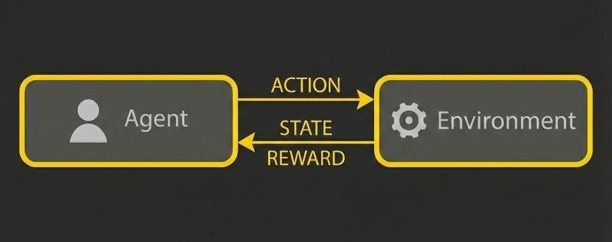
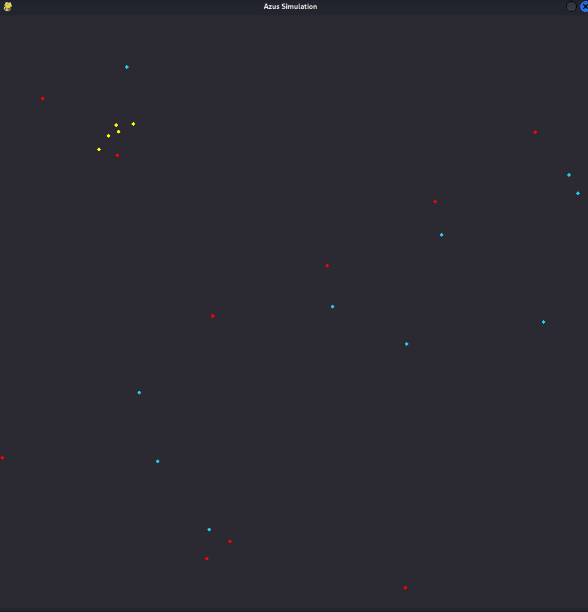

# azus-reinforced-learning

Multi-agent RL simulation exploring the interaction between 3 distinct agent types. Built with Python, Pygame, and Q-Learning to observe survival dynamics, resource competition, and emergent decision-making in a shared environment.




## Overview

This project simulates the coexistence of three distinct entities in a shared environment:
- **Azus** (blue dots) - A tribe that learns through reinforcement learning
- **Deer** (yellow dots) - Resource entities
- **Monsters** (red dots) - Hostile entities



The simulation uses **Q-Learning** with the **Bellman equation** to train Azus agents to survive and make optimal decisions based on their environment. Training progress is automatically saved to the `azus-brain/` directory, allowing the simulation to resume from where it left off.

## Learning Mechanism

The Azus agents learn through Q-Learning, updating their knowledge using the Bellman equation:

**Q(s, a) ← Q(s, a) + α[r + γ max Q(s', a') - Q(s, a)]**

Where:
- **s** = current state
- **a** = action taken
- **r** = reward received
- **α** = learning rate
- **γ** = discount factor
- **s'** = next state

## Exploration Feature

One of the most interesting aspects of this implementation is the **exploration incentive system**. To encourage Azus agents to explore their environment rather than getting stuck in local optima, I designed a mechanism that:

1. Tracks the visit frequency of each cell in the map
2. Identifies the least-visited neighboring cell around each agent
3. Converts this information into a discrete state (0-3) representing a direction
4. Rewards the agent for entering cells with below-average visit counts

The reward function for exploration is:

**R(cell) = max(min(-0.2(v - μ)³ + 1, 5), -1)**

Where:
- **v** = visit count of the current cell
- **μ** = average visit count across all cells
- The reward is capped between -1 and 5


## Features

- **Console output** displaying Azu characteristics during simulation

*Note: Some displayed characteristics in the current version are not yet utilized in the learning process.*

## Project Structure
```
azus-reinforced-learning/
├── azus-brain/          # Saved Q-tables and training data
├── pictures/            # Visualization assets
│   └── ReinforcedLearning.jpg
└── src/       # Python implementation
```

## Code Style

This project was developed with a focus on:
- **Clean code principles**
- **Readable and maintainable structure**
- **Proper documentation**
- **Modular design for easy extension**


The goal was to learn not just reinforcement learning concepts, but also best practices in software development. At least I tried to.

## Current Status

This project is **not finished** and serves primarily as a learning exercise. It was created to:
- Understand the fundamentals of reinforcement learning
- Practice Q-Learning implementation
- Develop clean, readable, and maintainable code
- Explore emergent behavior in multi-agent systems

I'm currently focusing on other projects, as this has fulfilled its educational purpose for now.

---
<p align="center">
  
</p>
